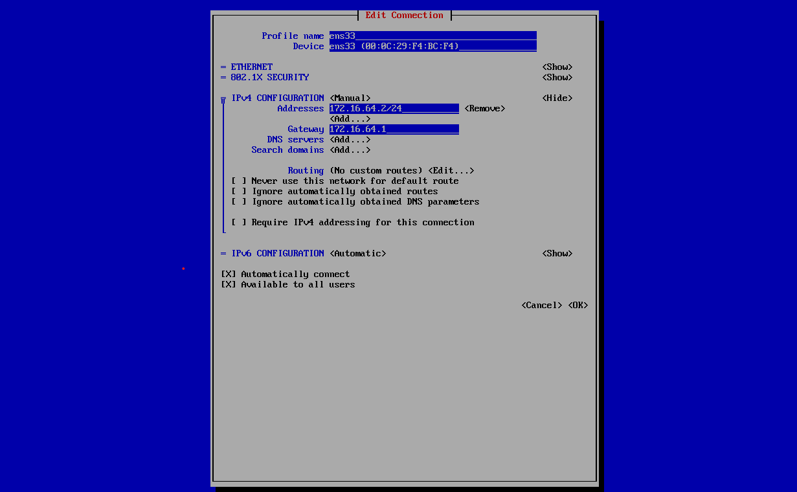
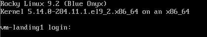

# labo-infra-reseau-2023
TP 18/10/2023


## 🎯 Quels sont les trois différents types de cloud computing disponibles ?
Les trois principaux types de cloud computing sont les suivants :

Cloud Public (Cloud public) : Dans un cloud public, les ressources informatiques sont mises à la disposition du public par un fournisseur de services cloud tiers. Ces ressources sont partagées entre de nombreux utilisateurs, ce qui les rend plus économiques et évolutives. Les utilisateurs paient généralement en fonction de leur utilisation. Exemples de fournisseurs de cloud public : Amazon Web Services (AWS), Microsoft Azure, Google Cloud Platform (GCP).

Cloud Privé (Cloud privé) : Un cloud privé est une infrastructure cloud dédiée à une seule organisation. Les ressources d'un cloud privé peuvent être hébergées sur site ou dans un centre de données tiers, mais elles sont utilisées exclusivement par l'organisation qui les possède. Les clouds privés offrent un plus grand contrôle sur la sécurité et la personnalisation, mais ils sont généralement plus coûteux que les clouds publics.

Cloud Hybride (Cloud hybride) : Le cloud hybride combine à la fois des environnements de cloud public et privé, permettant aux données et aux applications de fonctionner de manière transparente entre les deux. Cela offre une plus grande flexibilité, car les organisations peuvent tirer parti des avantages de l'extensibilité et de la rentabilité du cloud public tout en conservant un contrôle plus étroit sur les données sensibles dans un cloud privé. Le cloud hybride est particulièrement utile pour les entreprises qui ont des besoins variés en matière de traitement des données.


Créez deux machines virtuelles sur votre ordinateur avec votre hyperviseur de choix. Nommez-les respectivement landing-vm1 et landing-vm2.
Utilisez une image Rocky Linux pour l'installation.


## Donnez-leur des cartes réseau NAT, et ⏹️ associez-leur les adresses IP 172.16.64.2 et 172.16.64.3.

Utiliser la commande nmtui
```nmtui```
Et rentre les informations



## Changez le nom d'hôte des machines pour avoir respectivement vm-landing1 et vm-landing2

Pour la machine 1   
```hostnamectl set-hostname vm-landing1```    
Pour la machine 2   
```hostnamectl set-hostname vm-landing2```  

Penser a reboot les deux machines afin d'appliquer le nouveau hostname   

Après avoir redémarré, vous devriez avoir un nouveau hostname :   




## 🎰 Trouvez l'adresse IP locale des machines

[root@vm-landing1 ~]# ip a  
1: lo: <LOOPBACK,UP,LOWER_UP> mtu 65536 qdisc noqueue state   UNKNOWN group default qlen 1000  
    link/loopback 00:00:00:00:00:00 brd 00:00:00:00:00:00  
    inet 127.0.0.1/8 scope host lo  
       valid_lft forever preferred_lft forever  
    inet6 ::1/128 scope host  
       valid_lft forever preferred_lft forever  
2: ens33: <BROADCAST,MULTICAST,UP,LOWER_UP> mtu 1500 qdisc   fq_codel state UP group default qlen 1000
    link/ether 00:0c:29:f4:bc:f4 brd ff:ff:ff:ff:ff:ff
    altname enp2s1
    inet 172.16.64.2/24 brd 172.16.64.255 scope global noprefixroute ens33
       valid_lft forever preferred_lft forever
    inet6 fe80::20c:29ff:fef4:bcf4/64 scope link noprefixroute
       valid_lft forever preferred_lft forever


## 🎯 Quelle est l'adresse de broadcast ?

``````

## 🎰 Trouvez le masque de sous-réseau des machins

## 🎰 Trouvez l'adresse MAC des machines

