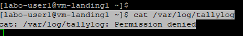

# labo-infra-reseau-2023
TP 18/10/2023
Mélange du TP 1 + 2

## 🎯 Quels sont les trois différents types de cloud computing disponibles ?
Les trois principaux types de cloud computing sont les suivants :

Cloud Public (Cloud public) : Dans un cloud public, les ressources informatiques sont mises à la disposition du public par un fournisseur de services cloud tiers. Ces ressources sont partagées entre de nombreux utilisateurs, ce qui les rend plus économiques et évolutives. Les utilisateurs paient généralement en fonction de leur utilisation. Exemples de fournisseurs de cloud public : Amazon Web Services (AWS), Microsoft Azure, Google Cloud Platform (GCP).

Cloud Privé (Cloud privé) : Un cloud privé est une infrastructure cloud dédiée à une seule organisation. Les ressources d'un cloud privé peuvent être hébergées sur site ou dans un centre de données tiers, mais elles sont utilisées exclusivement par l'organisation qui les possède. Les clouds privés offrent un plus grand contrôle sur la sécurité et la personnalisation, mais ils sont généralement plus coûteux que les clouds publics.

Cloud Hybride (Cloud hybride) : Le cloud hybride combine à la fois des environnements de cloud public et privé, permettant aux données et aux applications de fonctionner de manière transparente entre les deux. Cela offre une plus grande flexibilité, car les organisations peuvent tirer parti des avantages de l'extensibilité et de la rentabilité du cloud public tout en conservant un contrôle plus étroit sur les données sensibles dans un cloud privé. Le cloud hybride est particulièrement utile pour les entreprises qui ont des besoins variés en matière de traitement des données.


Créez deux machines virtuelles sur votre ordinateur avec votre hyperviseur de choix. Nommez-les respectivement landing-vm1 et landing-vm2.
Utilisez une image Rocky Linux pour l'installation.


## Donnez-leur des cartes réseau NAT, et ⏹️ associez-leur les adresses IP 172.16.64.2 et 172.16.64.3.

Utiliser la commande nmtui
```nmtui```
Et rentre les informations


## Changez le nom d'hôte des machines pour avoir respectivement vm-landing1 et vm-landing2

Pour la machine 1   
```hostnamectl set-hostname vm-landing1```    
Pour la machine 2   
```hostnamectl set-hostname vm-landing2```  

Penser a reboot les deux machines afin d'appliquer le nouveau hostname   

Après avoir redémarré, vous devriez avoir un nouveau hostname :   


## 🎰 Trouvez l'adresse IP locale des machines + ip + broadcast

__Machine 1__

```[root@vm-landing1 ~]# ip a```
```
1: lo: <LOOPBACK,UP,LOWER_UP> mtu 65536 qdisc noqueue state   UNKNOWN group default qlen 1000  
    link/loopback 00:00:00:00:00:00 brd 00:00:00:00:00:00  
    inet 127.0.0.1/8 scope host lo  
       valid_lft forever preferred_lft forever  
    inet6 ::1/128 scope host  
       valid_lft forever preferred_lft forever  
2: ens33: <BROADCAST,MULTICAST,UP,LOWER_UP> mtu 1500 qdisc   fq_codel state UP group default qlen 1000
    link/ether 00:0c:29:f4:bc:f4 brd ff:ff:ff:ff:ff:ff   */// <- ADDRESS MAC *
    altname enp2s1
    inet 172.16.64.2/24 brd 172.16.64.255 scope global    */// <- ADDRESS IP  + brd = BROADCAST*
       valid_lft forever preferred_lft forever
    inet6 fe80::20c:29ff:fef4:bcf4/64 scope link noprefixroute
       valid_lft forever preferred_lft forever
```
__Machine 2__

```[root@vm-landing1 ~]# ip a```
```
1: lo: <LOOPBACK,UP,LOWER_UP> mtu 65536 qdisc noqueue state   UNKNOWN group default qlen 1000  
    link/loopback 00:00:00:00:00:00 brd 00:00:00:00:00:00    
    inet 127.0.0.1/8 scope host lo      
       valid_lft forever preferred_lft forever   
    inet6 ::1/128 scope host    
       valid_lft forever preferred_lft forever    
2: ens33: <BROADCAST,MULTICAST,UP,LOWER_UP> mtu 1500 qdisc   fq_codel state UP group default qlen 1000  
    link/ether 00:0c:29:92:83:82 brd ff:ff:ff:ff:ff:ff   */// <- ADDRESS MAC *  
    altname enp2s1  
    inet 172.16.64.3/24 brd 172.16.64.255 scope global    */// <- ADDRESS IP  + brd = BROADCAST*  
       valid_lft forever preferred_lft forever  
    inet6 fe80::20c:29ff:fef4:bcf4/64 scope link noprefixroute  
       valid_lft forever preferred_lft forever  
```


## 🎰 Pingez l'adresse publique du site www.ynov.com avec une des deux machines

```ping www.ynov.com```

```PING www.ynov.com (172.67.74.226) 56(84) bytes of data.
  64 bytes from 172.67.74.226 (172.67.74.226): icmp_seq=1 ttl=128 time=14.5 ms  
  64 bytes from 172.67.74.226 (172.67.74.226): icmp_seq=2 ttl=128 time=16.4 ms  
  64 bytes from 172.67.74.226 (172.67.74.226): icmp_seq=3 ttl=128 time=17.8 ms  
  64 bytes from 172.67.74.226 (172.67.74.226): icmp_seq=4 ttl=128 time=19.8 ms  
  --- www.ynov.com ping statistics ---  
  4 packets  transmitted, 4 received, 0% packet loss, time 3005ms  
  rtt min/avg/max/mdev = 14.465/17.123/19.785/1.948 ms
```

---------------------------------------------------------
__Sur chaque machine, créez respectivement un utilisateur labo-user1 et labo-user2.
Changez son mot de passe, puis de compte et connectez-vous avec l'utilisateur labo-1__
 ---------------------------------------------------------   


## 🎰 Essayez de lire le contenu du fichier /var/log/tallylog

```[labo-user1@vm-landing1 ~]$ cat /var/log/tallylog```
```
cat: /var/log/tallylog: Permission denied
```
## 🎯 Vous remarquerez un problème. Pourquoi obtenez-vous cette erreur ?



Le user labo-user1 n'a pas les droit afin de lire le fichier *tallylog*  
Ajoutez ces utilisateurs au groupe wheel et retentez

🎯 Il n'y aura plus d'erreur. Pourquoi ?
L'erreur n'est plus la car l'utilisateur a spécifié qui souhaite exécuter cette commande en temps que su

Retentez en changeant d'utilisateur et en passant root
🎯 Ca devrait marcher. Pourquoi ?

Root possède les droits de super utilisateur

Ajoutez l'utilisateur labo-user1 au sudoers (petit coup de Google), puis retentez la commande sudo cat
🎯 Ca devrait marcher. Pourquoi ?

Suite à l'ajout de labo-user1 au groupe sudoers, il devient superuser sur la machine. 


Sur la machine landing-vm1 :

Installez les paquets sl, dnsmasq et htop. 

🎰 Vérifiez leur version  
```sl -version``  


```htop -v```     

```
htop 3.2.2
```

```dnsmasq -v```  

```
Dnsmasq version 2.85  Copyright (c) 2000-2021 Simon Kelley   
Compile time options: IPv6 GNU-getopt DBus no-UBus no-i18n IDN2 
DHCP DHCPv6 no-Lua TFTP no-conntrack ipset auth cryptohash   DNSSEC loop-detect inotify dumpfile

This software comes with ABSOLUTELY NO WARRANTY.  
Dnsmasq is free software, and you are welcome to redistribute it
under the terms of the GNU General Public License, version 2 or 3.
```


🎰 pingez google.com  

```
[root@vm-landing1 ~]# ping 8.8.8.8  
PING 8.8.8.8 (8.8.8.8) 56(84) bytes of data.  
64 bytes from 8.8.8.8: icmp_seq=1 ttl=128 time=30.9 ms  
64 bytes from 8.8.8.8: icmp_seq=2 ttl=128 time=32.3 ms  
64 bytes from 8.8.8.8: icmp_seq=3 ttl=128 time=30.5 ms  
64 bytes from 8.8.8.8: icmp_seq=4 ttl=128 time=32.4 ms  

--- 8.8.8.8 ping statistics ---  
4 packets transmitted, 4 received, 0% packet loss, time 3004ms  
rtt min/avg/max/mdev = 30.500/31.537/32.435/0.845 ms  

```


Sur la machine landing-vm1, changez la carte réseau en Host-Only.
🎯 Quelle est l'utilité de ce type de carte réseau ?

Elle permet d'isoler une machine du reste du réseau la communication ne se fait qu'entre la machine virtualisé et l'hôte, la carte réseau "host-only" dans VMware permet de créer un réseau virtuel isolé entre l'hôte physique et les machines virtuelles, offrant un contrôle total sur les communications au sein de cet environnement. Elle est utile pour divers scénarios de développement, de test, d'apprentissage et de sécurité.

🎰 Pingez landing-vm2 avec landing-vm1, que se passe-t-il ?

```ping 172.16.64.3```

La machine n'est pas joignable.


## Partie 2

Créez un fichier nommé checking.sh et rendez-le exécutable  
Modifiez ce fichier de script pour qu'il fasse les actions suivantes quand lancé :  
### Le script doit vérifier automatiquement les mises à jour
### Si vous lui passez l'argument --update, il doit les installer
### Il doit afficher de manière bien lisible les informations suivantes :
### Un grande message stylé affichant le nom du script
### Nom d'hôte du système
### Version du noyau Linux
### Date et heure du jour
### Adresse IPv4
### Adresse IPv6 de liaison locale
### Serveurs DNS présents
### Il doit vider le journal des logs (journalctl)
### Il doit vérifier si le pare-feu est activé

``` [root@vm-landing1 labo-user1]# ./checking.sh  
==========================================  
        Script de Vérification  
==========================================  
Nom d'hôte du système : vm-landing1  
Version du noyau Linux : 5.14.0-284.11.1.el9_2.x86_64  
Date et heure du jour : Wed Oct 18 16:01:39 CEST 2023  
Adresse IPv4 : 172.16.64.2  
Adresse IPv6 de liaison locale :  
Serveurs DNS présents :  
# Generated by NetworkManager  
nameserver 1.1.1.1  
Vidage du journal des logs...  
Vacuuming done, freed 0B of archived journals from /run/log/journal.  
Vacuuming done, freed 0B of archived journals from /run/log/journal/a2b01d1c483a45448d5b7a99969537ef.  
Le pare-feu est actif.  
```

``` FICHIER *checking.sh* 
#!/bin/bash  

# Fonction pour afficher un message stylé  
function display_message {  
    echo "=========================================="  
    echo "        Script de Vérification"  
    echo "=========================================="  
}

# Fonction pour vérifier si le pare-feu est actif  
function check_firewall {  
    if systemctl is-active --quiet firewalld; then  
        echo "Le pare-feu est actif."  
    else  
        echo "Le pare-feu n'est pas actif."  
    fi  
}

# Vérifie si l'option --update est passée en argument
if [ "$1" == "--update" ]; then
    display_message
    echo "Mises à jour du système en cours..."
    sudo yum -y update
fi

# Affiche les informations demandées
display_message
echo "Nom d'hôte du système : $(hostname)"
echo "Version du noyau Linux : $(uname -r)"
echo "Date et heure du jour : $(date)"
echo "Adresse IPv4 : $(hostname -I | cut -d' ' -f1)"
echo "Adresse IPv6 de liaison locale : $(hostname -I | cut -d' ' -f2)"
echo "Serveurs DNS présents :"
cat /etc/resolv.conf

# Vide le journal des logs
echo "Vidage du journal des logs..."
sudo journalctl --vacuum-time=1d

# Vérifie si le pare-feu est activé
check_firewall

```

